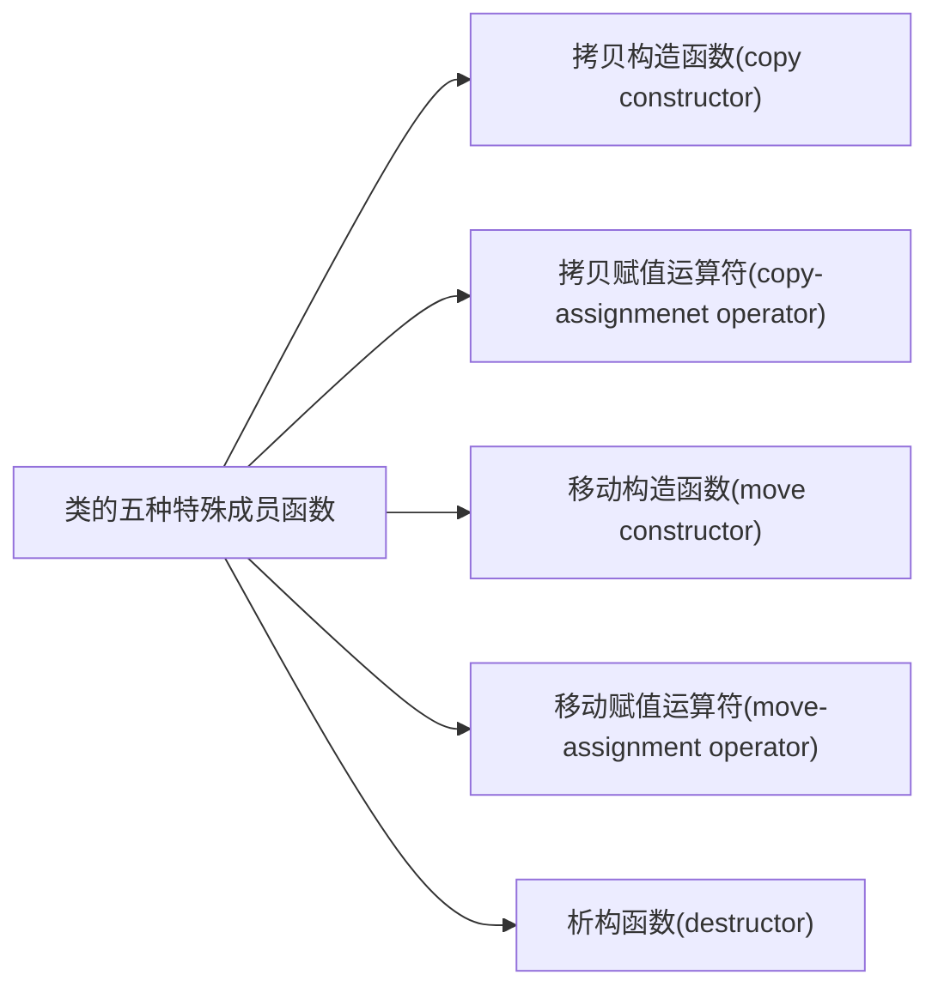

# 第十三章 拷贝控制


## 13.1 拷贝、赋值与销毁
最基本的操作
### 13.1.1 拷贝构造函数
```c++
class Foo{
    Foo();          //默认构造函数
    Foo(const Foo&);//拷贝构造函数
};
```
<p style = "color:gold">拷贝构造函数:第一个参数必须是一个引用类型，且任何额外参数都有默认值。(拷贝构造函数通常不应该是`explicit`)</p>

拷贝初始化不仅在我们用=定义变量时会发生，以下情况也会拷贝初始化
1. 将一个对象作为实参传递给一个非引用类型的形参
2. 从一个返回类型为非引用类型的函数返回一个对象
3. 用花括号列表初始化一个数组中的元素或聚合类中的成员

#### 练习13.1
拷贝构造函数: 第一个参数必须是一个引用类型。
什么时候使用它：当你想把一个对象的成员复制给另一个对象且两个对象不会相互涉及的时候。

#### 练习13.2
```c++
//Sales_data:: Sales_data(Sales_data rhs);
//正确的拷贝构造函数
Sales_data::Sales_data(const Sales_data& rhs);
```
如果是值传递的话 会无限循环。

#### 练习13.3
~~~c++
class StrBlob{
    private:
        shared_ptr<vector<string>> data;
};
//由于StrBlob的底层是一个指针指针，当我们拷贝的时候 引用数+1。

class StrBlobPtr{
    private:
        weak_ptr<vector<string>> ps;
}
//StrBlobPtr的底层是一个 weak_ptr是一个弱指针,其并不会增加 StrBlob的引用数
~~~
 拷贝 StrBlob 对象
1. 底层机制：
StrBlob 内部使用 std::shared_ptr<std::vector<std::string>> 管理动态分配的字符串向量。

2. 拷贝行为：
当拷贝一个 StrBlob 对象时（如 StrBlob b2 = b1;）：

调用合成的拷贝构造函数，复制内部的 shared_ptr。

shared_ptr 的引用计数增加 1。

原对象和新对象共享同一个底层 vector。

3. 结果：

修改任意对象的 vector（如添加/删除字符串）会影响另一个对象。

当所有 StrBlob 对象销毁时，vector 的内存才会释放。

 拷贝 StrBlobPtr 对象
1. 底层机制：
StrBlobPtr 内部包含：

std::weak_ptr<std::vector<std::string>>：观察 StrBlob 的 vector（不增加引用计数）。

size_t curr：记录当前元素下标。

2. 拷贝行为：
当拷贝一个 StrBlobPtr 对象时（如 StrBlobPtr p2 = p1;）：

调用合成的拷贝构造函数，复制 weak_ptr 和 curr 值。

weak_ptr 的拷贝不改变引用计数（不影响 vector 的生命周期）。

新对象与原对象指向相同的 vector 和下标位置。

3. 结果：

两个 StrBlobPtr 对象独立移动（如 ++p1 不影响 p2 的下标）。

如果原 StrBlob 被销毁，所有关联的 StrBlobPtr 会检测到 vector 已释放（通过 expired()）。


#### 练习13.4
~~~c++
//Point头文件
#ifndef _POINT_H_
#define _POINT_H_
#include <iostream>
class Point{
    private:
        int x;  
        int y;
    public:
        Point(int x, int y);
        Point(const Point& p);
};

Point::Point(int x, int y):x(x), y(y){
    std::cout << "Constructor called" << std::endl;
}

Point::Point(const Point& p):x(p.x), y(p.y){
    std::cout << "Copy constructor called" << std::endl;
}

#endif _POINT_H_

//main

#include "Point.h"
#include "include/HasPtr.h"
#include <iostream>

Point global(3,5);

Point foo_bar(Point p) {
    Point local = p , *heap = new Point(global); // heap = &local;
    *heap = local;
    // Point pa[4] = {local, *heap};   
    return *heap;
}

int main() {
    // // 创建一个Point对象p1，坐标为(1, 2)
    // Point p1(1, 2);
    // // 调用foo_bar函数，传入p1对象
    // foo_bar(p1);
    // // 等待用户输入，防止程序立即退出


    std::cin.get();
}
~~~
1. 值传递的(Point arg)
2. Point local = arg;
3. Point *heap = new Point(global);
4. returan *heap;

#### 练习13.5
~~~c++
#pragma once

#include <ostream>
#include <string>
class HasPtr{
    public:
    friend std::ostream& print(std::ostream &os, const HasPtr &it);

    HasPtr(const std::string &s = std::string()):ps(new std::string(s)),i(0){}
    HasPtr(const HasPtr& origin):ps(new std::string(*origin.ps)),i(origin.i){}

    ~HasPtr(){
        delete ps;
    }
    private:
        std::string *ps;
        int i;
};

std::ostream& print(std::ostream& os ,const HasPtr& it){
    os << it.ps << std::endl;
    return os;
}
~~~

#### 练习13.6
